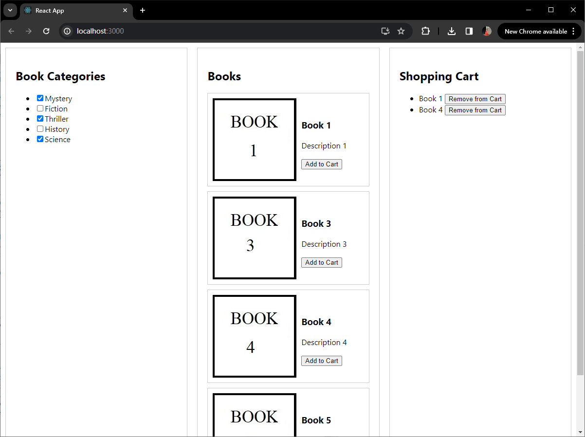

Please follow these general steps:

1. Extract the contents of the shared archive (if applicable).

2. Open a terminal or command prompt and navigate to the project folder.

3. Run `npm install` or `yarn install` to install the project dependencies based on the package.json file.

4. Run `npm start` or yarn start to start the development server.

Demo Page

