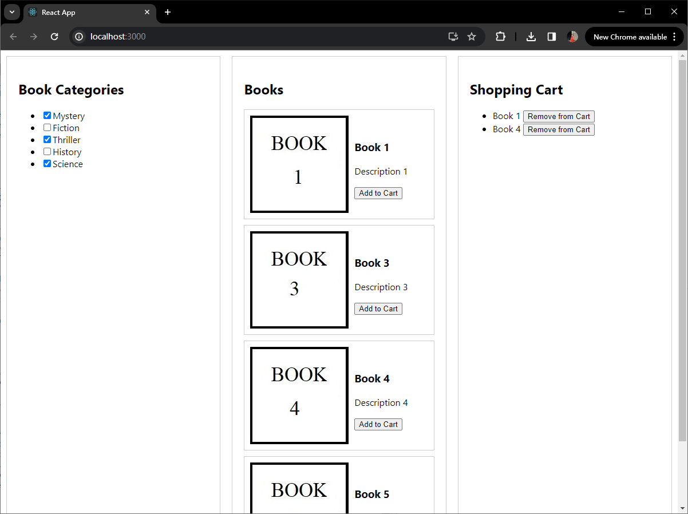

## Welcome to the answer to question 1. Bookstore

The running of the webpage need two parts: 
1. A webpage (REACT): `npm start`
2. A REST API: `node server.js`

## Setup
### Part 1. The main code is in [App.js](bookstore/src/App.js)

Please follow these steps:

1. Extract the contents.

2. Open a terminal or command prompt and navigate to the bookstore folder.

3. Run `npm install`to install the project dependencies based on the package.json file.

4. Run `npm start` to start the development server.

### Part 2. The main code is in [server.js](src/App.js)

1. Please install following packages:
`npm install express`
`npm install cors`

2. Open a terminal or command prompt and navigate to the RESTAPI folder.

3. Run `node server.js` to start the server.

### Demo Page

